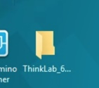
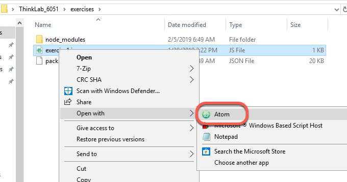
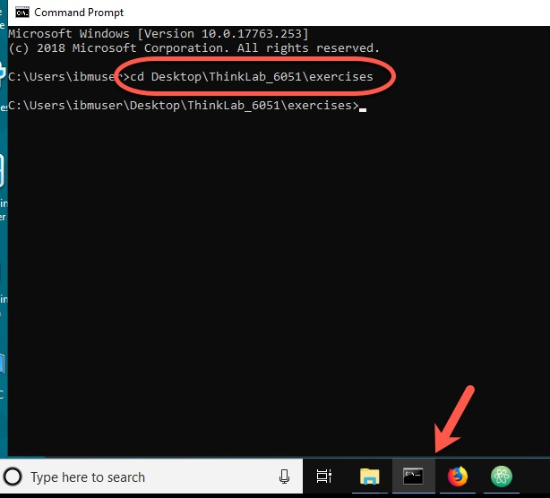
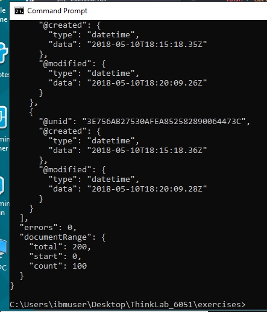

The **domino-db** package is installed and you are ready to write your first node.js application.  

From the Desktop, double click on the `Think_6051` directory.



From there, open the `exercises` directory, where you'll see the file called `exercise1.js`.  Right click on that file and choose **Open with -> Atom**.




The file should open in the Atom editor.  Note the first few lines of the code:

```JavaScript
const { useServer } = require('@domino/domino-db');

const serverConfig = {
  hostName: 'dominoserver',
  connection: {
    port: 9028,
  },
};
const databaseConfig = {
  filePath: 'dql/node-demo.nsf'
};
```
These lines do three things:
1. Require (import) the domino-db package.
2. Define the server by host name and port.
3. Identify the database to be used by directory and file name.

Starting on line 18 in the section which uses the `bulkReadDocuments` API call, passing a **query**.  That query is a Domino Query Language string which needs to be created in the application. You can see it in line 14, commented out.  Uncomment that line and save the file, as shown below.


This query will return all documents which have the string `Contact` in the field named `Form`.  Let's test the application from the command prompt.  Open a command prompt by clicking on its icon in the system tray.  Change to the `Desktop\Think_6051\exercises` directory, as shown below:



Run the program by typing `node exercise1.js` and hitting Enter.  You should see results scroll across the screen, similar to the screen shot below:



Note the `documentRange` object contains useful information about the query: there are a total of 200 documents in the database matching the query (`"total": 200`), and the call has returned 100 documents (`"count": 100`), starting with the first document (`"start": 0`).

Also notice that we have some information about each document. For each document, a Domino Query Language call will return three values:

1. `@unid` - the unique ID of the document
2. `@created` - the date the document was created
3. `@modified` - the date the document was last modified

This is somewhat useful to us, but we can also return the values in the various fields of the document. To do this, we modify the values we send in the `bulkReadDocuments` call.  We'll do that in the next exercise.
