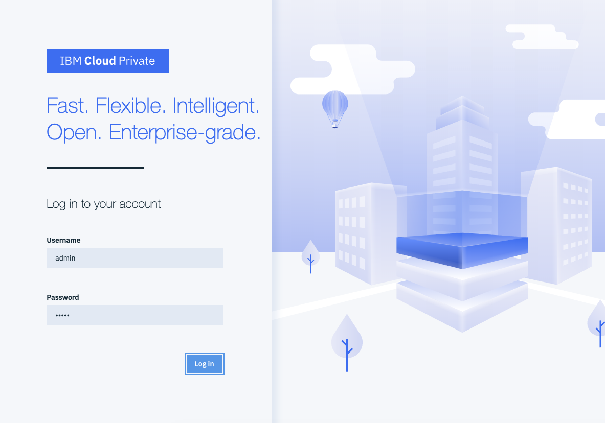
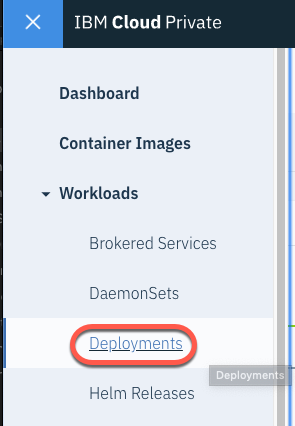
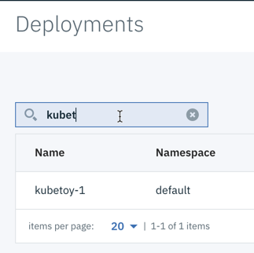
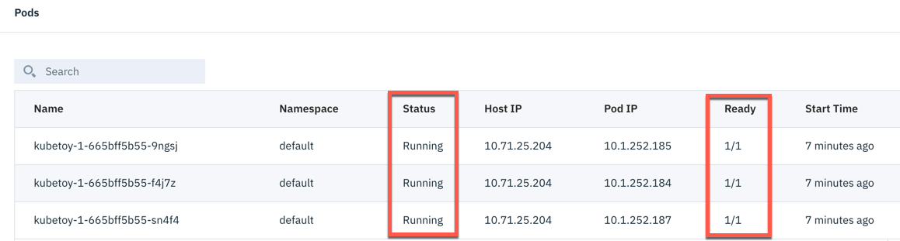

ICP and kubernetes provide a few different ways to troubleshoot an application. In this exericse, you'll see how to check an application's status, how to view an application's logs, how to identify a failing application, and you'll also see ICP's self-healing capabilities.

1. If you haven't done so already, log in to the ICP console (http://localhost:8443/oidc/login.jsp) with the username and password of `admin`.

    

1. From the menu, expand **Workloads** and choose **Deployments**.

    

1. If necessary, use the Search bar to filter the list of deployments in order to find the one your have just deployed (in our case, `kubetoy-1`).

    

1. Click on the deployment to show its details. Scroll down and you'll see the pods ICP has created for this deployment (in our case, 3 pods to match the helm chart we created).  You can observe the **Status** of the pods (they should show `Running`) and the number of pods desired/running in the **Ready** column (they should show `1/1`).

    