This section will show you how to view an application's logs in two ways: using the browser and using the command line.

1. The deployment page of an application shows each pod hosting the application. Float your cursor on the far right of one of the pods, and click on its ellipsis (the three dots). From the menu which appears, choose **View logs**.

    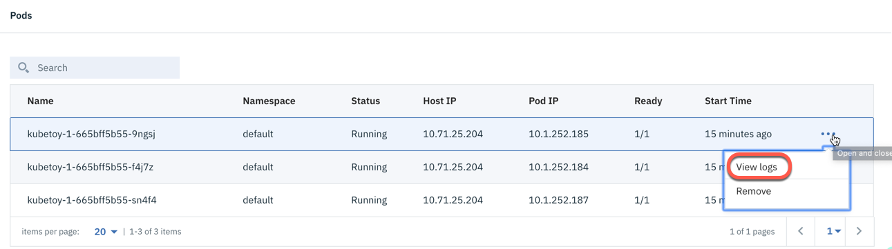

    ICP's kibana page opens, filtered to show only the logs produced by the pod we've chosen. Our application logs some information when it starts up, but your page may look like the following, showing no results.

    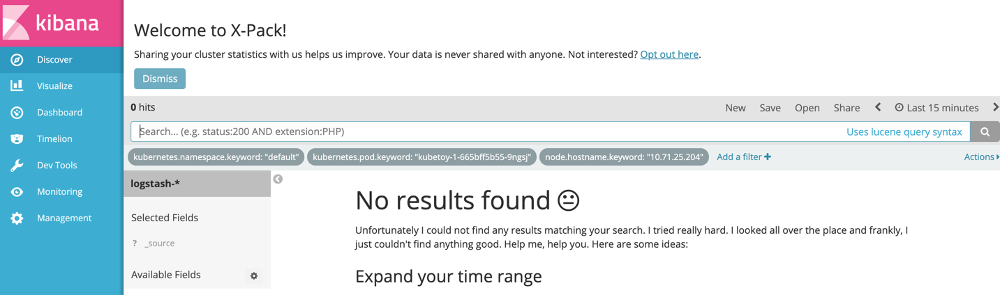

1. If you see no results, it's because your application started more than 15 minutes prior to when you viewed the logs, and the default filter for Kibana is to show the last 15 minutes worth of logs. Click the *left* arrow to go back in the logs until you see some logging output.

    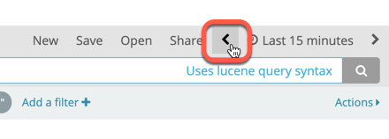


1. You should see logs like the following image. When our application starts, it logs three lines: its version number (`Version 1.8.1`, kernel information of the host machine (in this case, `Arch: x86_64, Release: 3.10.0-957.el7.x86_64`), and the pod name and listening port (`9ngsj: server starting on port 3000`). Leave this tab open while you continue with the lab.

    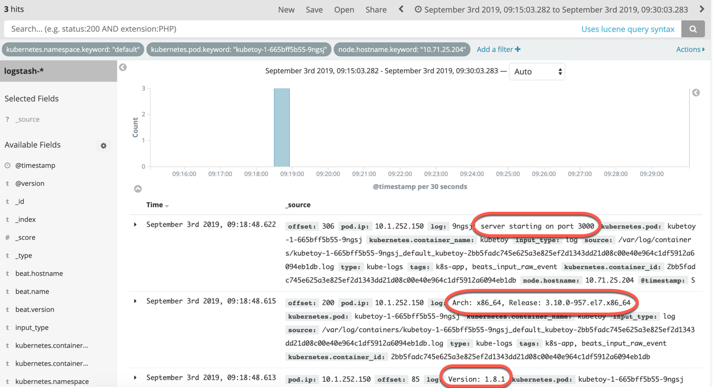

1. Let's use the application to put more infomation into the logs. In your browser, go back to the Deployment page for `kubetoy-1` and click on the **Launch** button in the top right.

    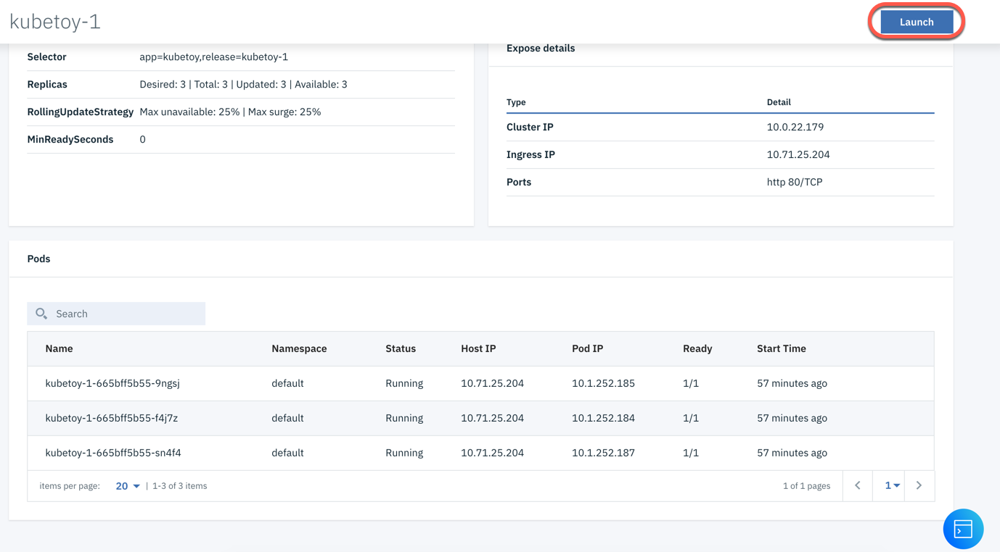

1. The Kubetoy application will open in a separate browser tab. You can use this application to write a message to the logs. Try it by putting a message in the text field marked **Message for stdout** and click the `Log it!` button.

    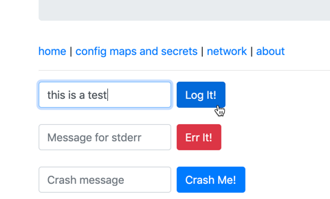

1. In your Kibana tab, use the right arrow to change the time filter, and you should see your log message appear.

    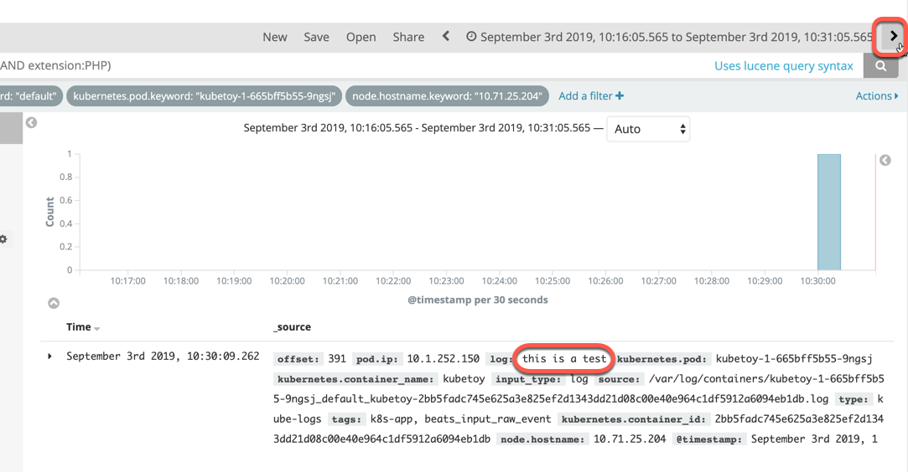

1. Now let's use the command line to view logs. ICP has a built-in way to use the command line from within the browser itself. Back on the Deployment page for the `kubetoy-1` application, click on the blue button in the lower right corner to open a command window.

    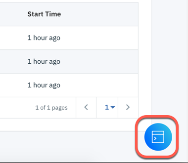

1. Click in the command window to give it focus, and log in to ICP by typing `cloudctl login` and hitting Enter. Use `admin` for the username and password. When prompted, choose the `default` namespace.  You should see an **OK** message and be returned to the command line, as in the following image:

    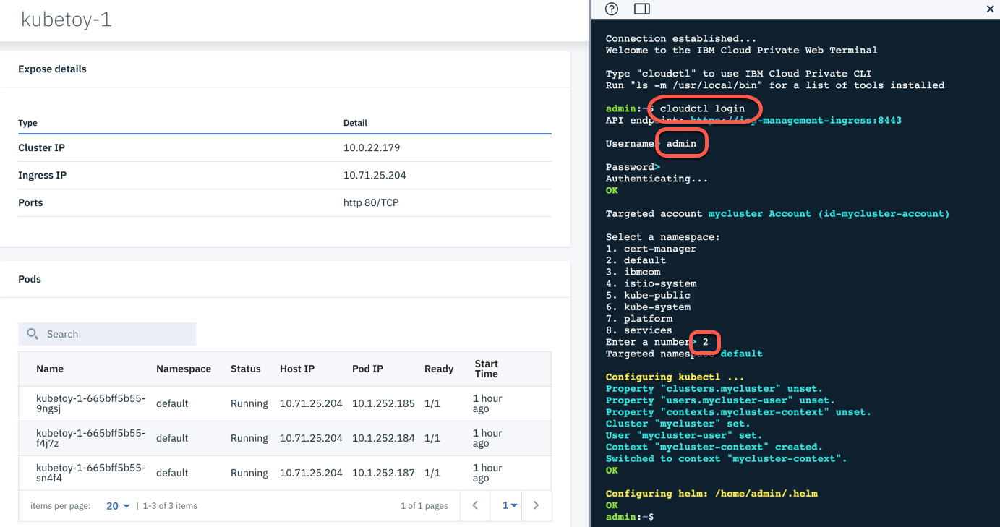


1. Type the following command, using *your* pod name (you can copy/paste the pod name from the browser window):

    ```
    kubectl logs -f <your pod name>
    ```

    In the example below, the pod name is **kubetoy-1-665bff5b55-9ngsj**.

    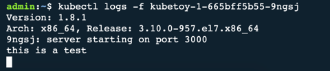

    You can see the same output here that we saw in Kibana. You can go back to the Kubetoy application and send another message to stdout or stderr and see it show up in the command window.

    | Create stderr message    | View stderr message |
    | :---: | :---: |
    | 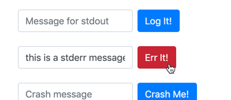   | 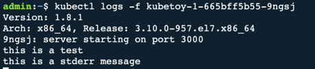 |
    

1. The command window in the browser times out after a short while; you can start over by closing the window and clicking the command window button again. To avoid this problem, open a command window on the system itself and execute the commands above to log in to ICP and begin logging the output of the pod. Experiment with issuing messages to stdout and stderr and observing them in the logs.