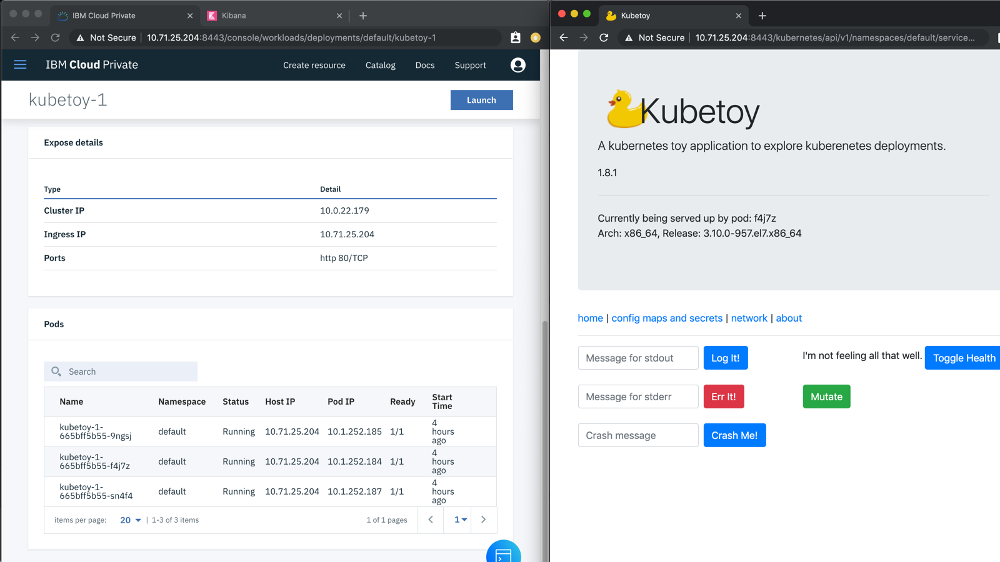

In this exercise, we'll see how ICP reports an application failure, and how it attempts to restart the application.

1. If you haven't already done so, open a command window on the system and log in to ICP and begin viewing the logs for a pod in our replica set. As a refresher from the last step, log in to ICP with `cloudctl login` (use `admin` for the username and password), and begin viewing the logs with `kubectl logs -f <your pod name>`. (Look at the previous step for details on executing these commands).

1. For this step, you'll want to show two browser windows side by side. Detach the Kubetoy window (opened in the previous step) and position it and the Deployment window so they can both be viewed at the same time, with the Deployment window showing the Pods, as in this image:

    

1. Crash the Kubetoy application intentionally by providing a message in the **Crash message** text box and clicking the `Crash Me!` button.  Quickly refresh the browser window showing the Deployment; you'll see one of the pods change **Status** to `Terminating` and the **Ready** state change to `0/1`, as in the following image:

    

1. Refresh again, as ICP will attempt to restart the application. If it succeeds, the pods will once again all have a **Status** of `Running` and a **Ready** count of `1/1`.  The browser window with the Kubetoy application will briefly show a crash message, and then a connection refused message such as the following:

     

    You can refresh this browser window to show the running application again, and crash it again to see the behavior repeated.

1. In Step 1 above you opened a command window and began streaming the logs for this application. Go to the command window and see the message you entered, plus some details about where the application crashed.

    

1. In Kibana, navigate to the place in the log which displays the same message. You'll see the error messages, plus the messages the application provides when starting:

    

Congratulations! You finished these exercises, which walked you through viewing the status of a deployment,viewing the logs, and seeing how ICP handles an application failure.